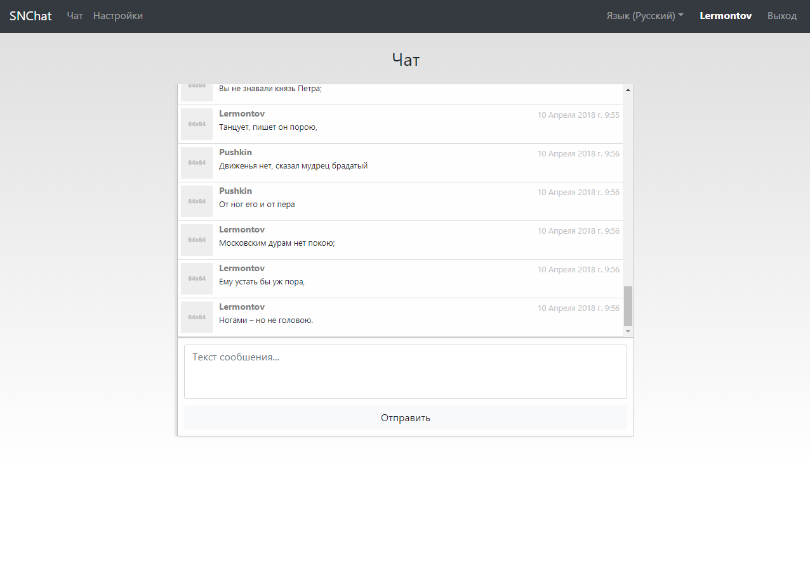

# SNChat
Чат на Node.js, MongoDB, Socket.IO

### Функциональность 

* Авторизация и регистрация пользователей
* Редактирование пароля
* Чат
* Смена языка (русский, английский)

### Установка

* Установить NodeJS, MongoDB
* cd snchat
* npm install

### Запуск

* Запустить сервер MongoDB
* cd snchat
* node app.js

### Скриншот

